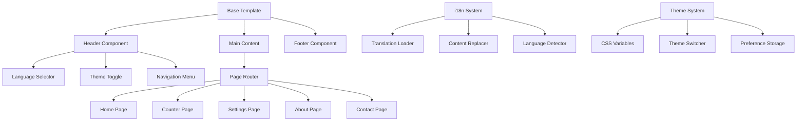

# I18n Template Project Architecture

## Project Overview

A multi-page internationalized template supporting Spanish, Russian, and English with light/dark themes and a word/character counter tool.

## Directory Structure

```
i18n-template/
├── index.html                 # Home/Dashboard page
├── pages/
│   ├── counter.html          # Word/Character counter tool
│   ├── settings.html         # Settings and preferences
│   ├── about.html            # About page
│   └── contact.html          # Contact page
├── assets/
│   ├── css/
│   │   ├── reset.css         # CSS reset and normalize
│   │   ├── variables.css     # CSS custom properties for themes
│   │   ├── base.css          # Base styles and layout
│   │   ├── components.css    # Reusable components
│   │   └── pages.css         # Page-specific styles
│   ├── js/
│   │   ├── i18n.js           # Internationalization system
│   │   ├── theme.js          # Theme switching logic
│   │   ├── navigation.js     # Navigation and routing
│   │   ├── counter.js        # Counter functionality
│   │   └── main.js           # Main application logic
│   └── images/
│       └── icons/            # Theme and UI icons
└── locales/
    ├── en.json               # English translations
    ├── es.json               # Spanish translations
    └── ru.json               # Russian translations
```

## Technical Implementation Strategy

### 1. Theme System

- CSS custom properties (CSS variables) for dynamic theming
- Two theme variants: `light` and `dark`
- Smooth transitions between themes
- System preference detection with manual override

### 2. Internationalization System

- JSON-based translation files for each language
- JavaScript i18n engine with key-based translation lookup
- Dynamic content replacement using data attributes
- Language persistence in localStorage
- Fallback to browser language detection

### 3. Navigation System

- Single-page application feel with multi-page structure
- Smooth page transitions
- Active state management
- Mobile-responsive hamburger menu

### 4. Component Architecture



### 5. Counter Tool Features

- Real-time word counting (space-separated)
- Character counting (with/without spaces)
- Line counting
- Reading time estimation
- Text statistics display
- Copy/clear functionality

### 6. Settings Page Features

- Theme selection (Light/Dark/Auto)
- Language preferences
- Counter tool settings
- Data export/import options
- Reset to defaults

## Key Technical Decisions

1. **Pure Vanilla JavaScript**: No frameworks for maximum compatibility and minimal dependencies
2. **CSS Grid & Flexbox**: Modern layout techniques for responsive design
3. **Progressive Enhancement**: Core functionality works without JavaScript
4. **Accessibility First**: WCAG 2.1 AA compliance from the start
5. **Mobile-First Design**: Responsive design starting from mobile breakpoints

## Browser Compatibility

- Modern browsers (Chrome 60+, Firefox 55+, Safari 12+, Edge 79+)
- Graceful degradation for older browsers
- CSS feature detection with fallbacks

## Implementation Phases

### Phase 1: Foundation

- Project structure setup
- Base HTML templates
- CSS framework with theme system
- Basic navigation

### Phase 2: Internationalization

- JSON translation files
- i18n JavaScript system
- Language switching functionality
- Content localization

### Phase 3: Core Features

- Counter tool implementation
- Settings page functionality
- Theme persistence
- User preferences

### Phase 4: Content Pages

- Home/Dashboard content
- About page information
- Contact page with form
- Documentation

### Phase 5: Polish & Accessibility

- Responsive design refinement
- Accessibility improvements
- Performance optimization
- Cross-browser testing

## File Naming Conventions

- HTML files: lowercase with hyphens (e.g., `contact.html`)
- CSS files: lowercase with hyphens (e.g., `base.css`)
- JavaScript files: camelCase (e.g., `i18n.js`)
- JSON files: lowercase language codes (e.g., `en.json`)

## Development Guidelines

- Use semantic HTML5 elements
- Follow BEM methodology for CSS classes
- Implement progressive enhancement
- Maintain consistent code formatting
- Include comprehensive comments
- Test across target browsers
